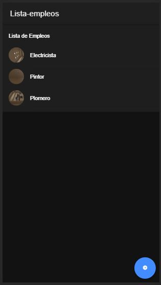
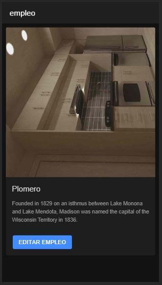

# appEmpleos

Se agrega el plugin para captura de imágenes por medio de la cámada del dispositivo, y se almacenan en cada empleo. 
Las imágenes se visualizan en la lista de empleos como avatar, y en el detalle de cada empleo

 
